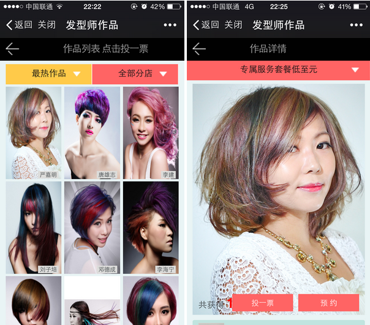
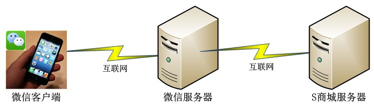

现阶段，在微信朋友圈举办的投票活动层出不穷，相信已经有不少同学对此不胜其烦，因为总会时不时地冒出个人（亲戚、朋友、or whatever）来请你帮TA投票。

本文倒没有打算从道德或者情感层面来探讨这个问题，我所感兴趣的是，当前大多数投票活动其实都是存在明显漏洞的，通过简单的技术手段就可以实现“刷票”。

## 案例描述

这里就有一个案例。

某美发网上商城（以下简称S商城）在微信平台上举办了一场在线投票活动，微信用户可通过活动链接访问到投票页面，对喜欢的发型师作品进行投票；每个微信帐号每天只能给单个作品投1张选票。

投票活动页面如下图所示：



## 漏洞分析

表面上看，S商城已经对投票活动进行了反作弊处理，因为限制了每个微信用户每天只能投一张票。如果用户都是正常地通过微信访问这个投票服务进行投票的话，的确是能起到预期效果的。

然而，如果查看投票页面的原始地址，即按住页面向下拖动，会发现屏幕顶端显示为"本网页由XXX提供"，需要注意的是，这里的"XXX"并不是"mp.weixin.qq.com"，而是S商城的域名。也就是说，这个投票活动的程序是运行在S商城的服务器上面的。

基于以上分析，可以推断出用户投票操作的网络拓扑结构示意图应该是这样的：



微信用户访问投票页面时，微信服务器只是进行了请求转发，具体的投票计数与校验都是在S商城的服务器上的。

那么，S商城是怎么来区分投票用户的呢？

这里就涉及到微信公众平台`OpenID`的概念了。官方对`OpenID`的解释是：加密后的微信号，每个用户对每个公众号的OpenID是唯一的。

要验证这一点也很容易，只需要通过采用多个微信账号进行投票，并对投票过程进行网络抓包，查看POST中的参数就可以证实。

基于这一点，微信公众平台在转发投票请求时，会在POST参数中包含用户的`OpenID`；S商城在接收到投票的POST请求后，通过查询当前`OpenID`是否在当天已经投过票，就可以阻止单一用户重复投票的行为了。

然而，这里面却存在一个很大的漏洞！

S商城只能判断`OpenID`是否出现了重复，但是却无法校验`OpenID`的有效性，因为它是无法调用微信服务器来对这个`OpenID`进行校验的。

## VoteRobot实现

明确了这个漏洞后，要实现刷票就很简单了。

- 采用微信用户正常地进行一次投票操作，对设备进行网络抓包，获取到投票过程中HTTP层面的请求参数和响应内容；
- 使用Fiddler（或Python脚本）构造投票的HTTP POST请求，保持各参数与真实投票时抓取到的参数内容一致；
- 随机生成不同的`OpenID`参数，重复进行POST请求。

如果要实现批量刷票，或者刷票自动化操作，那么就可以将刷票请求通过Python脚本来实现；甚至，采用LoadRunner也是可以的。

运行`VoteRobot.py`，输出日志如下：

```
======== Start to vote zpid(38), Total votes: 3
1 tickets has been voted, the next ticket will be voted after 35 seconds.
2 tickets has been voted, the next ticket will be voted after 31 seconds.
3 tickets has been voted, the next ticket will be voted after 10 seconds.
======== Voting Ended!
```

需要注意的是，通常自动化刷票时最好有个随机的时间间隔，并且，最好能动态模拟不同的设备，即修改`User-Agent`，否则，服务端可以较为容易地识别作弊行为。

## 作弊与反作弊？

看到这里，也许有的同学心中窃喜，以后投票都可以采用这种方式“刷票”了么？

很遗憾，当然不是。

其实本文中案例的漏洞是很低级的，只是，当前的确还存在不少比例的投票活动是采用这种模式。

要判断一个投票活动是否可以采用这种方式来作弊也很简单。采用本文中的方法，若查看到活动的网址是非微信官方的，而且整个投票过程也没有额外的校验，那么实现作弊的可能性就很大了；再通过抓包看下通讯交互过程，并用网络请求工具修改参数后重新请求下，即可验证是否真的可以作弊了。

另外，也许有人想问了，网络中的投票活动就没法杜绝“刷票”行为了么？

答案是，完全杜绝的确很难。听说过12306的黄牛党没？听说过Apple Store专业给应用刷榜单的没？听说过“网络水军”、“五毛党”没？

不过，活动举办方可以通过一些手段，大大提高作弊的门槛。例如，当前有不少活动就采用了如下方式：

- 要求投票用户先关注活动举办方的公众号，然后调用微信官方的投票功能；
- 要求投票用户在投票活动举办方的网站上进行注册（手机号验证、实名验证）

不管采用这两种方式中的哪一种，本文中的“刷票”方法就完全失效了。
